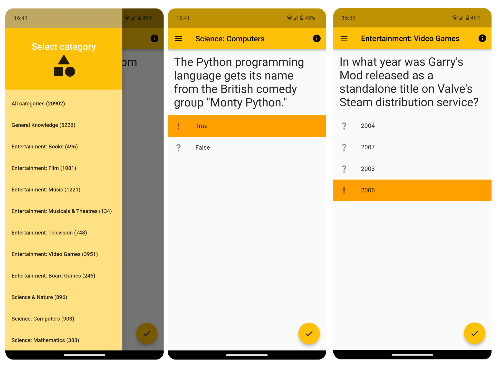

# Trivia App

A very simple android app made with flutter that tests your trivia. You can either have all the categories at once or choose one of the many categories available.

Uses [Open Trivia DB](https://opentdb.com/) for all the content.

## Downloads

You can get the apk file from the releases tab here on github.

> [!IMPORTANT]
> This was made quickly, without a lot of knowledge and a long time ago. There may be problems. Run at your own risk.
